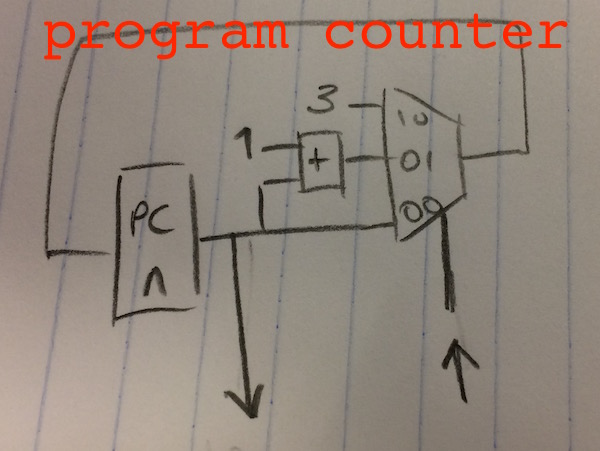
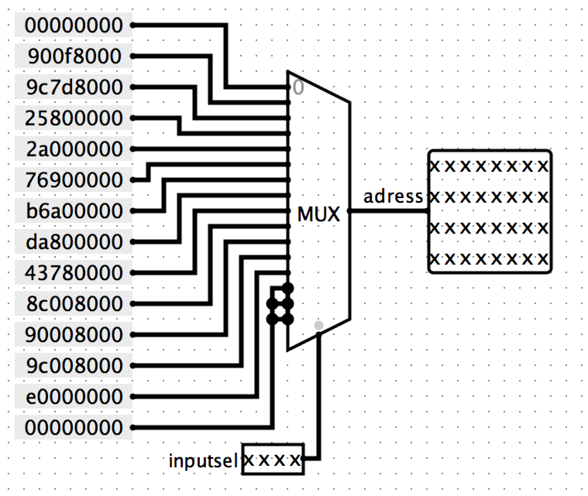
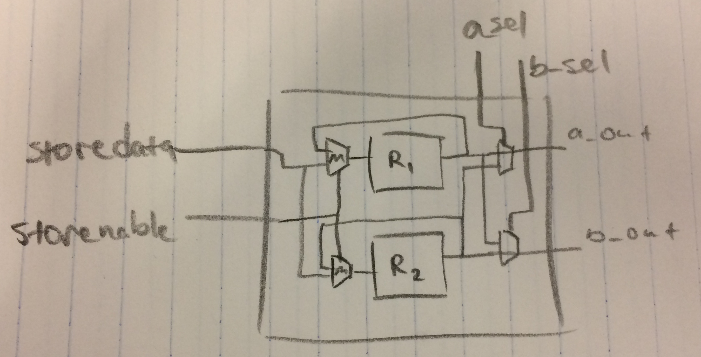

# Implementation 

To perform Moving Window Integration:

* Addition
* Subtraction
* Division by 30
* Read / Write to / from memory

In order to run though the commands in order and repeat the necessary ones, a register, an adder and a multiplexer are combined to build a *program counter (PC)*. 
 --->
<!--- 

The *PC* has a 4-bit output which starts at zero and increments by one every clock cycle. It has an input which can freeze or set the register to a pre-determined value on the next clock cycle. Freezing or setting the value are used to implement the BRANCH and NOP operations.

Now that we can iterate, jump and freeze, we need to implement the list of instructions. The *opcode* is contained in the *instruction memory (InstMem)* component as 16 hex-encoded 32-bit instructions selected by a multiplexer. The instructions are selected by a 4-bit input and returned on *InstMem*'s 32-bit output.

<!--- 

As mentioned in the design section, our opcode follows the structure **[OP] [ARG] [ARG] [ARG]** containing several pieces of information. As a result, the instruction on the output of *InstMem* consists of several pieces of information and is thus split between several components. 

The bits are split such that:

* [31:29] The first three bits go to the control component which determines which operation is being executed and configures the circuit to perform this operation.
* [28:20] The next nine bits are sent to the *register file (RegFile)*. The *RegFile* contains the registers in the CPU memory which store values and memory addresses used for the operations. The bits received tell the *RegFile* which registers write to and which values to output. More on this later.
* [23:15] The last three bits sent to the *RegFile* are also sent to a multiplexer in the circuit together with the next 5 bits in the instruction. These bits may include a value from the instruction which is needed for one of the operations or may be zero.

The *RegFile* receives 9-bits [28:20] of input from the 32-bits of *InstMem*'s output. The bits are split into three different inputs of the regfile. 
	*  [28:26] - 
	*  [25:23] - 
	*  [20:22] - 